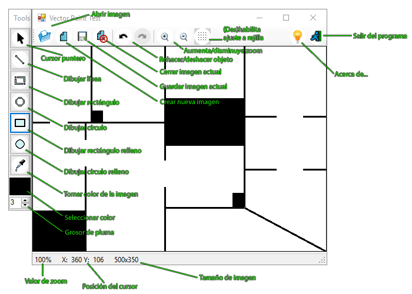
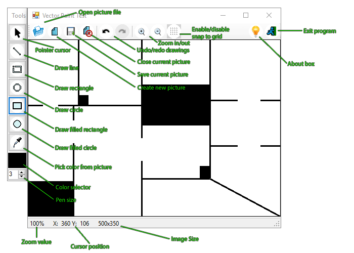

# VectorPaint: 
A simple prototype of drawing application

------------------------------------ 
        (Spanish / Español)* 
------------------------------------ 
* English version below

> ¿Qué es este programa?

Es un prototipo de aplicación de dibujo para una aplicación más grande que está a punto de ver la luz.

Básicamente, se pueden cargar imágenes o crear una nueva, y dibujar formas básicas sobre ellas.
La idea es realizar planos de pisos para una aplicación de estudio de coberturas.

> ¿Es difícil de usar?

Es bastante intuitiva y simple. Es un prototipo para lo que es: un módulo de dibujo simple de una aplicación de estudio de coverturas en desarrollo.

Ejemplo de la interfaz:

------------------------------------
         (English / Inglés)
------------------------------------

> What is this program?

It is a drawing application prototype for a larger application that is about to see the light.

Basically, you can upload images or create a new one, and draw basic shapes on them. The idea is to make floor plans to study signal coverages.

> Is it hard to use?

It is quite intuitive and simple. It is a prototype for what it is: a simple drawing module of an application to study signal coverages, still on development.

Example interface:

